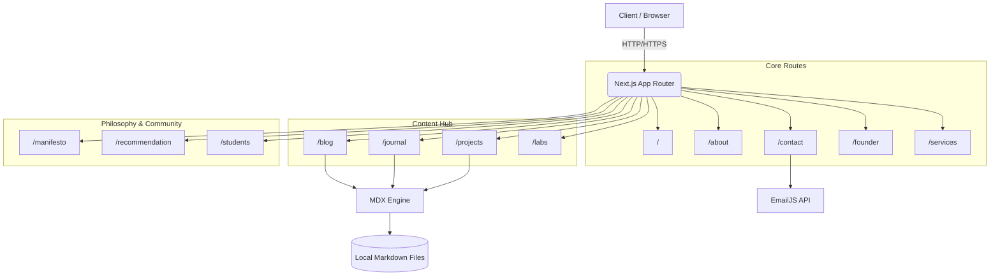
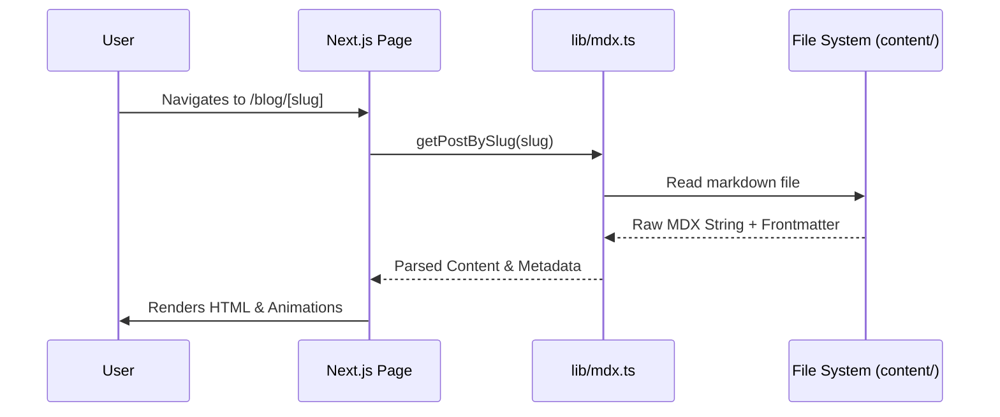
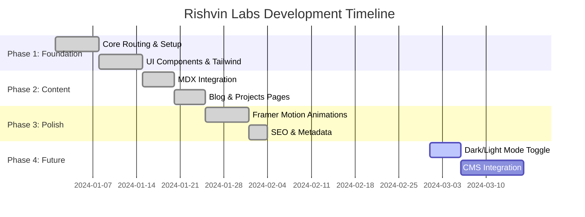

<div align="center">
  <h1>🚀 Rishvin Labs</h1>
  <p><strong>A Next-Generation Digital Laboratory & Portfolio</strong></p>

  <!-- Badges -->
  <p>
    
    
    
    
    
  </p>
</div>

<hr />

## 📖 Table of Contents

- [About The Project](#-about-the-project)
- [System Architecture](#-system-architecture)
- [Key Features](#-key-features)
- [Technology Stack](#-technology-stack)
- [Project Structure](#-project-structure)
- [Data Flow Diagram](#-data-flow-diagram)
- [Getting Started](#-getting-started)
- [Development Roadmap](#-development-roadmap)
- [Contributing](#-contributing)
- [License](#-license)

## 🌟 About The Project

**Rishvin Labs** is an ultra-modern, interactive, and fully responsive web application serving as a digital portfolio, manifesto, and service hub. Built with the latest cutting-edge technologies like Next.js App Router, Tailwind CSS 4, and Framer Motion, it offers a seamless user experience, lightning-fast performance, and top-tier SEO optimizations.

Whether you're exploring the founder's vision, reading the journal, or engaging with services, Rishvin Labs sets a new standard for personal and professional web platforms.

## 🏛 System Architecture

The following diagram illustrates the high-level architecture and page routing of the application.



## ✨ Key Features

- **Blazing Fast Performance**: Utilizing Next.js Server Components and advanced caching.
- **Dynamic Content**: Seamlessly rendered Markdown (MDX) integration for blogs and journals.
- **Cinematic Animations**: Powered by Framer Motion for scroll-reveals, micro-interactions, and page transitions.
- **Modern Styling**: Next-generation Tailwind CSS styling with dynamic glassmorphism and modern UI paradigms.
- **SEO Optimized**: Dynamic metadata, structured sitemaps, and optimized `robots.txt`.
- **Serverless Form Handling**: Integrated `EmailJS` for secure, backend-free contact forms.

## 🛠 Technology Stack

| Category | Technology |
| :--- | :--- |
| **Framework** | Next.js 15+ (App Router) |
| **Language** | TypeScript |
| **Styling** | Tailwind CSS v4 |
| **Animations** | Framer Motion |
| **Content Management**| `gray-matter`, `next-mdx-remote` |
| **Icons** | Lucide React |
| **Email Service** | EmailJS |
| **Linting/Formatting**| ESLint |

## 📁 Project Structure

```text
rishvin-labs/
├── app/                  # Next.js App Router routes (pages & layouts)
│   ├── blog/             # Blog dynamic routes
│   ├── contact/          # Contact page with EmailJS integration
│   ├── projects/         # Portfolio projects gallery
│   └── ...               # (Other routes: about, founder, labs, manifesto, etc.)
├── components/           # Reusable React components
│   ├── ui/               # Base UI components (buttons, cards, inputs)
│   ├── layout/           # Navbar, Footer, and structural components
│   └── animations/       # Framer Motion animated wrappers
├── content/              # MDX files for static content generation
├── data/                 # Static JSON or TypeScript data objects
├── lib/                  # Utility functions and helper methods
├── public/               # Static assets (images, fonts, favicons)
├── types/                # Global TypeScript definitions
└── package.json          # Project dependencies and scripts
```

## 🔄 Data Flow Diagram

Understanding how content flows from the file system to the user interface:



## 🚀 Getting Started

Follow these instructions to set up the project locally.

### Prerequisites

- Node.js (v18.17 or higher)
- npm, yarn, pnpm, or bun

### Installation

1. **Clone the repository:**
   ```bash
   git clone https://github.com/RishvinReddy/Rishvin-Labs.git
   cd Rishvin-Labs
   ```

2. **Install dependencies:**
   ```bash
   npm install
   # or
   yarn install
   # or
   pnpm install
   ```

3. **Set up environment variables:**
   Create a `.env.local` file in the root directory and add your keys (e.g., EmailJS credentials).
   ```env
   NEXT_PUBLIC_EMAILJS_SERVICE_ID=your_service_id
   NEXT_PUBLIC_EMAILJS_TEMPLATE_ID=your_template_id
   NEXT_PUBLIC_EMAILJS_PUBLIC_KEY=your_public_key
   ```

4. **Run the development server:**
   ```bash
   npm run dev
   ```

5. **Open your browser:**
   Navigate to [http://localhost:3000](http://localhost:3000).

## 🗺 Development Roadmap



## 🤝 Contributing

Contributions are what make the open source community such an amazing place to learn, inspire, and create. Any contributions you make are **greatly appreciated**.

1. Fork the Project
2. Create your Feature Branch (`git checkout -b feature/AmazingFeature`)
3. Commit your Changes (`git commit -m 'Add some AmazingFeature'`)
4. Push to the Branch (`git push origin feature/AmazingFeature`)
5. Open a Pull Request

## 📄 License

Distributed under the MIT License. See `LICENSE` for more information.

---
<div align="center">
  <i>Built with passion by Rishvin Reddy</i>
</div>
